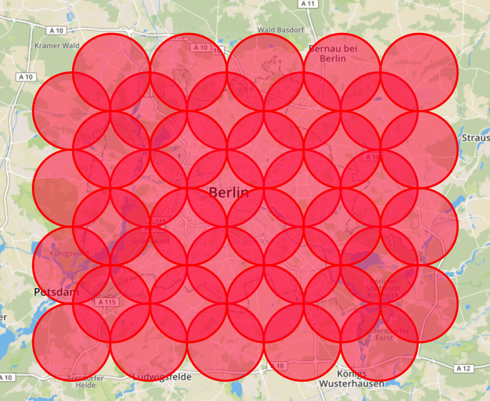

# circles-covering-bbox

A script to get all circle center coordinates, of all circles needed to cover the area of a bounding box. 

Some APIs only allow queries bound to maximum radius. In order to get all items within a larger area than the max. radius multiple queries are necessary. 
This script gets all needed circle centers for a given bounding box and radius.

Set radius and bounding box in get_circle_centers.py accordinly and run the script. The centers will be saved in centers.csv. 
To check the returned coordinates visually, ajust the radius in view_circles_on_map.html and add your mapbox access token and open in a browser.

 

(This script is only usable for rather small areas (e.g. a city), as always the start_lat is used to calculate new longs. For larger areas a the longitude needs to be calculated according to the proper latitutde.)